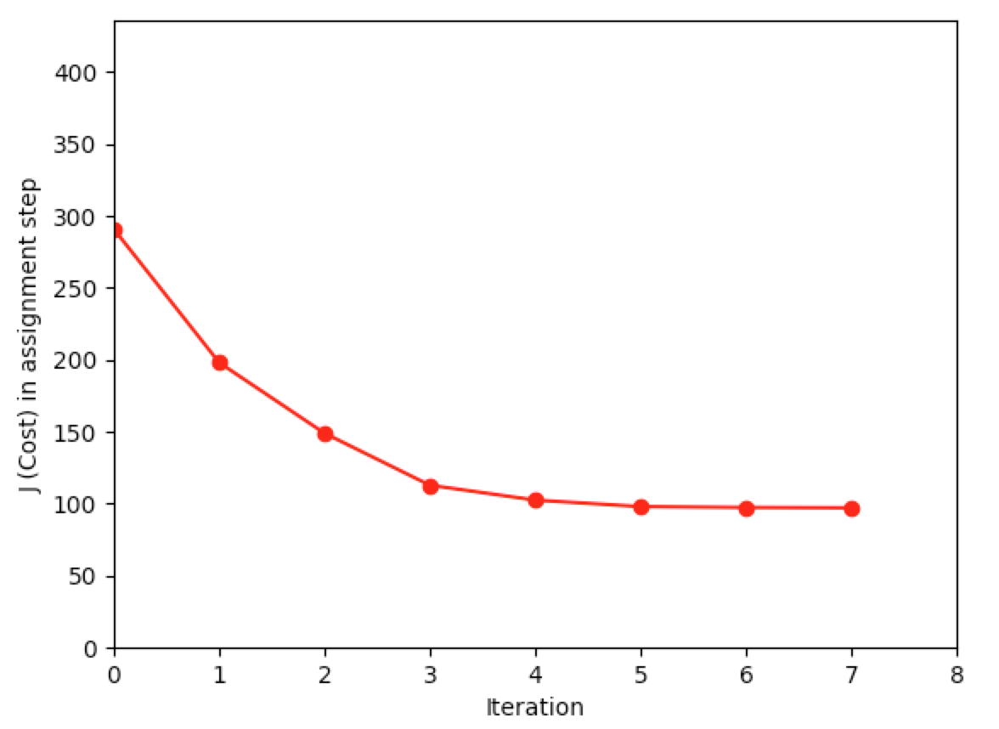

# K-means clustering algorithm

- Use K-means clustering algorithm to group the samples into K=3 clusters.
- Plot the cost of assignment step vs iteration.



(Note: `pipenv` doesn't work with `matplotlib` 😕)

## Get started

> First time

```bash
make all
```

> After first time

```bash
make start
```


## Dependency:

- Python 3+
- numpy
- matplotlib
- xlrd
